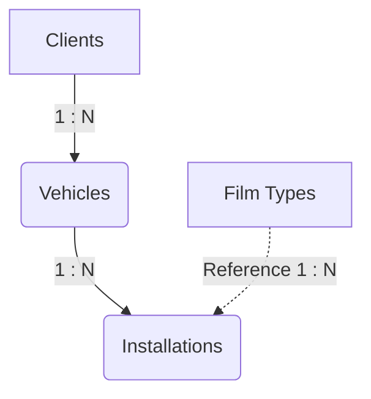

# PeliculaApp

O **PeliculaApp** é uma aplicação web focada na gestão operacional e de relacionamento para estabelecimentos de instalação de películas automotivas e arquitetônicas. A plataforma permite o gerenciamento inteligente de clientes, veículos, catálogo de produtos e automação completa do acompanhamento de garantias através de uma interface robusta.

## 🚀 Arquitetura e Tecnologias

O projeto está estruturado em um formato SPA (Single Page Application) moderno interligado a uma infraestrutura Backend-as-a-Service (BaaS) operada pelo Supabase.

### Frontend
- **Interface e Estilização:** Desenvolvido em HTML5 estrutural, CSS3 para variações nativas e inteligência do framework utilitário estilo **TailwindCSS** buscando otimização Mobile-First.
- **Lógica e Roteamento:** Construído completamente em **JavaScript Vanilla**, lidando com injeção flexível de views do DOM sem reload, requisições de backend via SDK e validações.
- **APIs de Terceiros:** Integração com **ViaCEP** no cadastro de clientes para autocompletar endereços de forma transparente e enxuta na UX.

### Backend / Banco de Dados (Supabase)
- **Engine Relacional:** Operado pelo PostgreSQL 15+ para máxima segurança, relações hierárquicas e garantias transacionais de chaves estrangeiras;
- **Autenticação:** Gerido estritamente através do Supabase Auth (GoTrue), manipulando JWTs na ponte para as respostas e trancando views para o lojista via _Auth Gates_.
- **Row Level Security (RLS):** Toda query do app sofre intercepção pelas _Policies_ de banco, eliminando dados expostos publicamente se a API Key for vazada sem um cookie de autenticação ativo.

---

## 🎯 Funcionalidades Principais

1. **Dashboard Inteligente**
   O lojista é recebido por métricas atualizadas e um painel preditivo que exibe ativamente **Garantias Próximas ao Vencimento** em formato sub-30 dias reduzindo a necessidade de buscas manuais no acervo.

2. **CRM de Clientes (`clients`)**
   Acessível através de pesquisas dinâmicas por CPF (como chave de unicidade). Cadastra fluxos amplos desde os endereços simplificados ao histórico de aquisição e contatos com edição instantânea.

3. **Catálogo de Películas (`film_types`)**
   Visualização completa das linhas base comercializadas listando os detalhes como descrições técnicas, marca, grupo arquitetônico/solar e uma pré-configuração natural de durabilidade em meses para automatizar os calendários.

4. **Lifecycle de Veículos e Instalações (`vehicles` e `installations`)**
   Cada placa mapeada e armazenada carrega múltiplos logs das execuções atreladas. Todo registro captura a data atual, os vidros/peças marcados durante a implementação e a regra final sobre o cronograma de vida do insulfilm em escala de cores e _status_.

---

## 🗄️ Estrutura do Banco de Dados

A rede de dados prioriza integridade relacional. Exclusões no ramo primário (`clients`) desencadeiam limpezas `CASCADE`, mantendo o armazenamento otimizado.

### Diagrama Simplificado

### Inteligência a Nível de Banco de Dados

Uma das grandes virtudes do núcleo de sistema é remover o fardo de processos matemáticos contínuos de dentro do arquivo JavaScript nativo, delegando as validações fundamentais pro ecossistema Postgres:

- **View `warranties_expiring_soon`**: Puxa em um único endpoint limpo os cruzamentos relacionais sem que o Frontend precise iterar múltiplos arrays de clientes apenas para elencar as notificações de "vencimento da dashboard" e os dados de contato do condutor.
- **PL/pgSQL Triggers Automáticos**:  
    - Cálculo de vida da película autossuficiente (`calculate_warranty_until`): Atualiza em banco o fim do projeto apenas aplicando o `interval` mensal cadastrado dinâmico sobre um `installed_at`.
    - Gestão referida aos rastros temporais de manipulação garantindo uma integridade via `updated_at`.
- **Worker Cron (`pg_cron`) diário**: Sistema que é evocado todo dia na base das 03:00 da madrugada identificando as películas atrasadas do sistema e realizando atualizações de enum sem impacto visual de loading do funcionário para rebaixar o seu flag a `expired`.

## ⚙️ Implantação e Configuração

Para o sistema ir ao ar:
1. Requer a carga inicial via cópia do diagrama SQL base do repo para a Engine do SQL no Dashboard do Supabase.
2. Inserção de chaves Anon Key em variáveis na head do Index web (`SUPA_URL` e `SUPA_KEY`).
3. Adição do gatilho configurador em Vercel via domínios com o webhook para as chaves operando no re-direct de recuperações de acessos de lojista.
