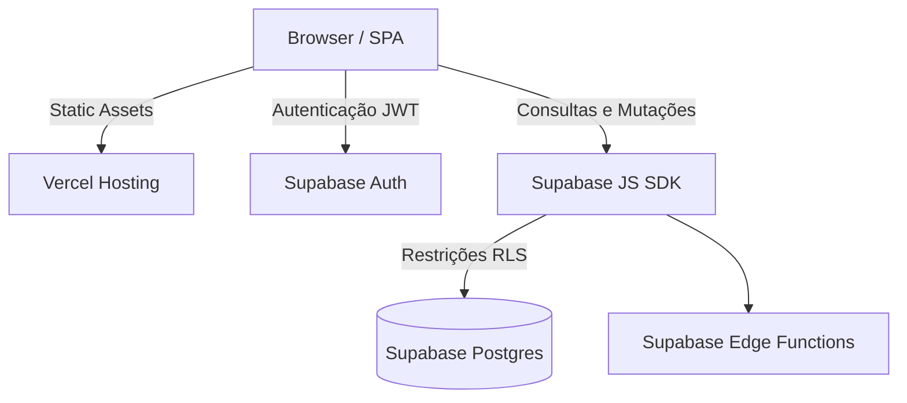

# Arquitetura do Sistema

## Visão Geral

O PeliculaApp é uma SPA (Single Page Application) conectada a um Backend-as-a-Service (Supabase). O deploy dos ativos de frontend é realizado na Vercel.

## Diagrama de Fluxo Alto Nível

## Frontend

- Tecnologias: Interface desenvolvida em HTML5, CSS3 e usando o framework TailwindCSS.
- Lógica: Toda a lógica client-side é nativa, utilizando JavaScript Vanilla. O roteamento e renderização de views ocorrem via manipulação de DOM.

## Backend e Integração (Supabase)

- Edge Functions: Scripts executados no Supabase com Service Role Key para ações administrativas (como gestão de perfis de usuário).
- Row Level Security (RLS): A validação de acesso aos dados é validada por Policies no banco de dados, garantindo que usuários autenticados só possam ler ou escrever dados autorizados.
