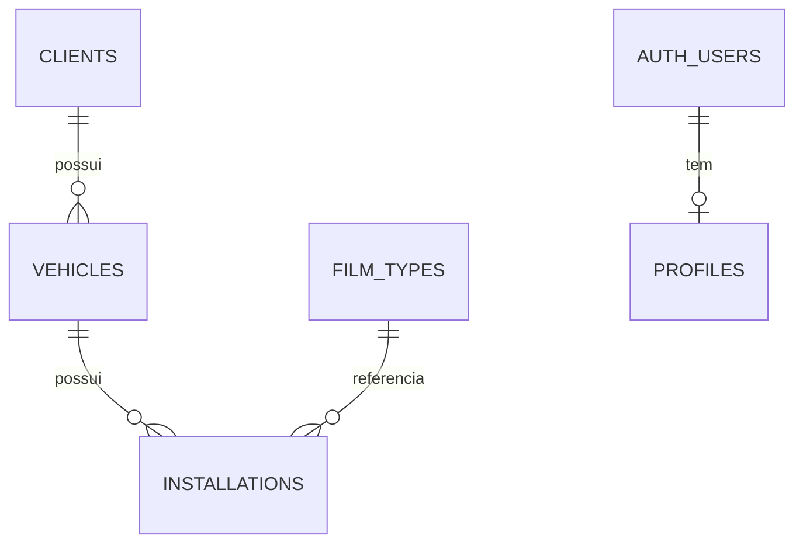

# Banco de Dados — PeliculaApp

O banco de dados do sistema utiliza PostgreSQL hospedado no Supabase. O projeto garante integridade relacional com uso de Foreign Keys, restrições Cascade e triggers.

## Diagrama de Relacionamento

## Estrutura das Tabelas

### Tabela `stores`

**Propósito:** Representa as unidades físicas da Markel Film para segregação de acesso e controle.

**Colunas:**

| Coluna | Tipo | Restrições | Descrição |
|---|---|---|---|
| `id` | `UUID` | PK, DEFAULT uuid_generate_v4() | Chave primária |
| `name` | `TEXT` | NOT NULL | Nome da loja |
| `address` | `TEXT` | — | Endereço da loja |
| `phone` | `VARCHAR(20)`| — | Telefone / WhatsApp |
| `is_active` | `BOOLEAN` | NOT NULL, DEFAULT true | Se a loja está ativa |
| `created_at` | `TIMESTAMPTZ` | NOT NULL, DEFAULT now() | Data de criação |

**Relacionamentos:**
- Nenhum.

### Tabela `profiles`

**Propósito:** Armazena os dados de perfil dos usuários do sistema e define a hierarquia de controle de acesso.

**Colunas:**

| Coluna | Tipo | Restrições | Descrição |
|---|---|---|---|
| `id` | `UUID` | PK | Chave primária |
| `user_id` | `UUID` | UNIQUE, NOT NULL | Referência para `auth.users(id)` |
| `email` | `TEXT` | NOT NULL | E-mail do usuário |
| `display_name` | `TEXT` | — | Nome de exibição |
| `role` | `TEXT` | NOT NULL | Nível de permissão (`admin` ou `employee`) |
| `store_id` | `UUID` | — | Referência para `stores(id)` |
| `is_active` | `BOOLEAN` | NOT NULL, DEFAULT true | Se o perfil está ativo |
| `created_at` | `TIMESTAMPTZ` | NOT NULL, DEFAULT now() | Data de criação |
| `updated_at` | `TIMESTAMPTZ` | NOT NULL, DEFAULT now() | Data da última atualização |

**Relacionamentos:**
- FK `user_id` → `auth.users(id)`
- FK `store_id` → `stores(id)`
- Cascade: ON DELETE CASCADE

**Observações:** O campo `role` é utilizado pelas policies RLS e Edge Functions para validar permissões administrativas.

### Tabela `clients`

**Propósito:** Armazena os dados pessoais e de contato de cada cliente, utilizando o CPF como identificador na regra de negócio.

**Colunas:**

| Coluna | Tipo | Restrições | Descrição |
|---|---|---|---|
| `id` | `UUID` | PK, DEFAULT uuid_generate_v4() | Chave primária |
| `cpf` | `VARCHAR(11)` | UNIQUE, NOT NULL | CPF sem formatação |
| `full_name` | `TEXT` | NOT NULL | Nome completo do cliente |
| `email` | `TEXT` | — | E-mail de contato |
| `phone` | `VARCHAR(20)`| — | Telefone / WhatsApp |
| `birth_date` | `DATE` | — | Data de nascimento |
| `address_street` | `TEXT` | — | Logradouro |
| `address_number` | `TEXT` | — | Número residencial |
| `address_complement`| `TEXT` | — | Complemento (apto, bloco) |
| `address_district` | `TEXT` | — | Bairro |
| `address_city` | `TEXT` | — | Cidade |
| `address_state` | `CHAR(2)` | — | UF (ex: SP) |
| `address_zip_code`| `VARCHAR(9)` | — | CEP com traço (ex: 01310-100) |
| `notes` | `TEXT` | — | Observações gerais |
| `created_at` | `TIMESTAMPTZ` | NOT NULL, DEFAULT now() | Data de criação |
| `updated_at` | `TIMESTAMPTZ` | NOT NULL, DEFAULT now() | Atualização via trigger |

**Relacionamentos:**
- Nenhum.

**Observações:** CPFs são armazenados contendo apenas os numerais. Existe um índice GIN de `to_tsvector` na coluna `full_name` para buscas.

### Tabela `vehicles`

**Propósito:** Gerencia o cadastro dos veículos, relacionando-os a um cliente dono.

**Colunas:**

| Coluna | Tipo | Restrições | Descrição |
|---|---|---|---|
| `id` | `UUID` | PK, DEFAULT uuid_generate_v4() | Chave primária |
| `client_id` | `UUID` | NOT NULL | Referência para `clients(id)` |
| `brand` | `TEXT` | NOT NULL | Marca do veículo |
| `model` | `TEXT` | NOT NULL | Modelo |
| `year` | `SMALLINT` | NOT NULL | Ano de fabricação |
| `color` | `TEXT` | — | Cor do veículo |
| `plate` | `VARCHAR(8)` | UNIQUE, NOT NULL | Placa do veículo sem traço |
| `notes` | `TEXT` | — | Observações sobre o veículo |
| `created_at` | `TIMESTAMPTZ` | NOT NULL, DEFAULT now() | Data de criação |
| `updated_at` | `TIMESTAMPTZ` | NOT NULL, DEFAULT now() | Atualização via trigger |

**Relacionamentos:**
- FK `client_id` → `clients(id)`
- Cascade: ON DELETE CASCADE

**Observações:** A exclusão de um cliente remove os veículos e instalações em cascata.

### Tabela `film_types`

**Propósito:** Define o catálogo de películas disponíveis para instalação e suas regras de validade base.

**Colunas:**

| Coluna | Tipo | Restrições | Descrição |
|---|---|---|---|
| `id` | `UUID` | PK, DEFAULT uuid_generate_v4() | Chave primária |
| `name` | `TEXT` | UNIQUE, NOT NULL | Nome do produto |
| `brand` | `TEXT` | — | Fabricante |
| `category` | `TEXT` | — | Categoria (ex: solar, segurança) |
| `description` | `TEXT` | — | Descrição detalhada |
| `warranty_months`| `SMALLINT` | — | Garantia padrão em meses |
| `is_active` | `BOOLEAN` | NOT NULL, DEFAULT true | Indica se o produto está disponível |
| `created_at` | `TIMESTAMPTZ` | NOT NULL, DEFAULT now() | Data de criação |
| `updated_at` | `TIMESTAMPTZ` | NOT NULL, DEFAULT now() | Atualização via trigger |

**Relacionamentos:**
- Nenhum.

**Observações:** Nenhuma.

### Tabela `installations`

**Propósito:** Registra o histórico de instalações de produtos nos veículos.

**Colunas:**

| Coluna | Tipo | Restrições | Descrição |
|---|---|---|---|
| `id` | `UUID` | PK, DEFAULT uuid_generate_v4() | Chave primária |
| `store_id` | `UUID` | NOT NULL, DEFAULT loja 1 | Referência para `stores(id)` |
| `vehicle_id` | `UUID` | NOT NULL | Referência para `vehicles(id)` |
| `film_type_id` | `UUID` | — | Referência para `film_types(id)` |
| `installed_at` | `DATE` | NOT NULL, DEFAULT CURRENT_DATE | Data da instalação |
| `warranty_months`| `SMALLINT` | — | Sobrescreve a garantia do produto |
| `warranty_until` | `DATE` | Calculada via trigger | Data final de vigência da garantia |
| `covered_parts`| `TEXT[]` | — | Array com as áreas de vidro aplicadas |
| `status` | `ENUM` | NOT NULL, DEFAULT 'active' | Situação da instalação |
| `notes` | `TEXT` | — | Anotações da instalação |
| `installed_by` | `UUID` | — | Referência para `auth.users(id)` |
| `created_at` | `TIMESTAMPTZ` | NOT NULL, DEFAULT now() | Data de criação |
| `updated_at` | `TIMESTAMPTZ` | NOT NULL, DEFAULT now() | Atualização via trigger |

**Relacionamentos:**
- FK `store_id` → `stores(id)` (ON DELETE RESTRICT)
- FK `vehicle_id` → `vehicles(id)` (ON DELETE CASCADE)
- FK `film_type_id` → `film_types(id)` (ON DELETE SET NULL)
- FK `installed_by` → `auth.users(id)` (ON DELETE SET NULL)

**Observações:** O tipo `status` baseia-se no enum `installation_status` (`active`, `expired`, `removed`).

## Views e Cron Jobs

### View `warranties_expiring_soon`
Fornece dados estruturados contendo as instalações ativas cujo vencimento ocorrerá em um intervalo de 30 dias.

### Rotina Diária de Expiração (`pg_cron`)
A extensão de banco `pg_cron` agenda a execução diária (03:00) da função `expire_overdue_warranties()`. A função atualiza o status de instalações para `expired` quando a data corrente ultrapassa o campo `warranty_until`.

## Histórico de migrations aplicadas

Os registros abaixo descrevem as alterações e estruturas aplicadas na base de produção. O código SQL referente a cada item está disponível em `docs/archive/banco-de-dados-supabase.md` e `docs/archive/mudancas-supabase-antigravity.md`.

| Recurso / Migration | Descrição da alteração |
|---|---|
| Criação das tabelas base | Estruturação de `clients`, `vehicles`, `installations`, `film_types` e trigger `handle_updated_at`. |
| Trigger de garantia | Implementação da função `calculate_warranty_until`. |
| Policies RLS | Definição das policies RLS baseadas no usuário logado (`auth.uid()`). |
| Criação da View | Criação da view `warranties_expiring_soon`. |
| Job cronológico | Configuração da varredura que expira películas. |
| Criação da tabela `profiles` | Criação da tabela `profiles` e vinculação de roles ao Supabase Auth, além de suas respectivas policies RLS. |
